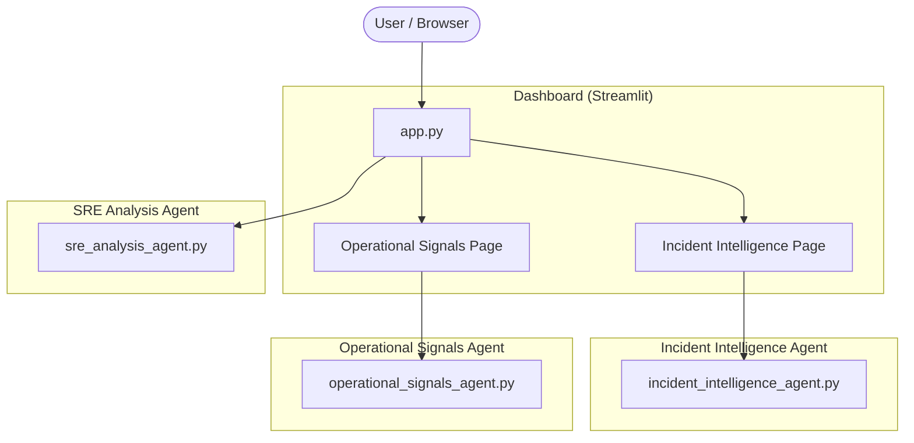
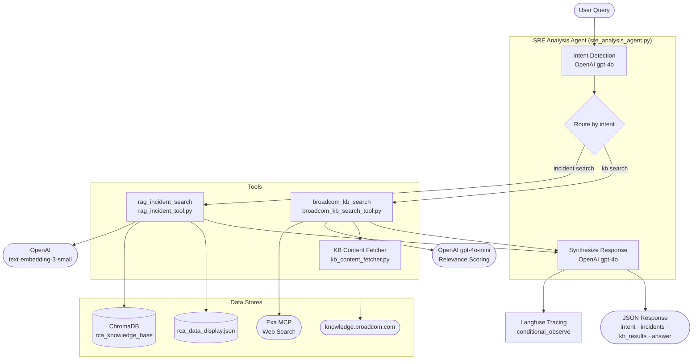
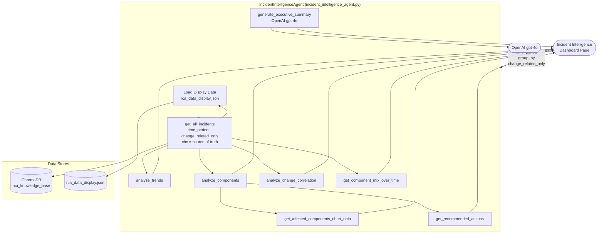
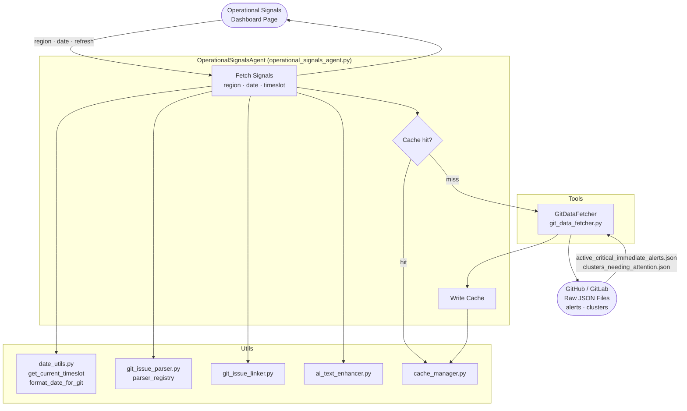
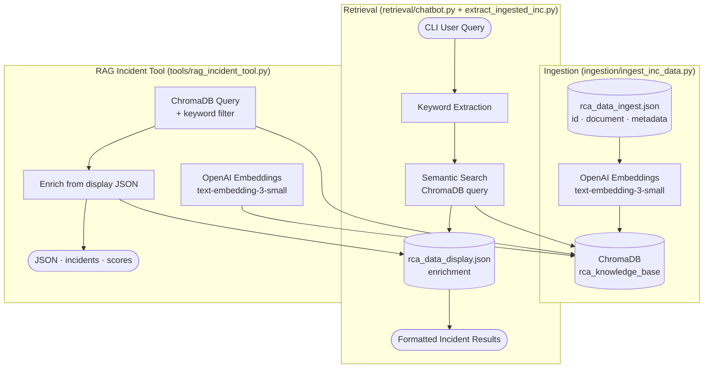
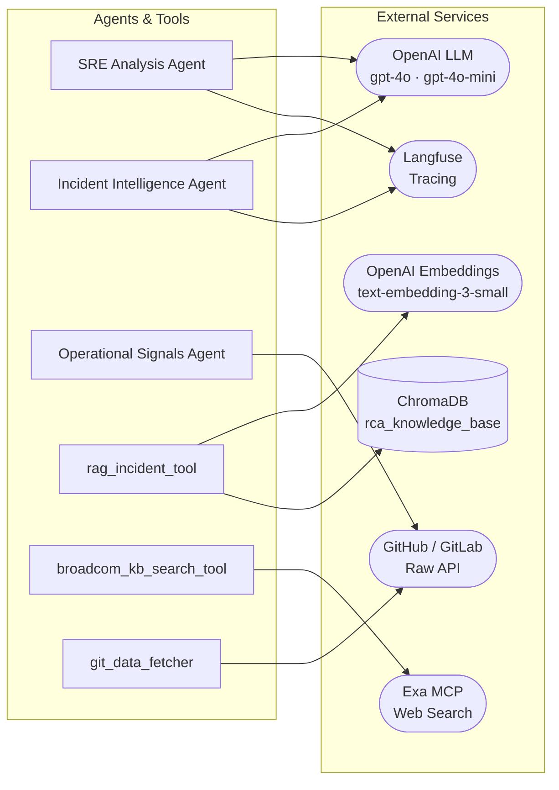

# Agent Architecture & Data Flow

All diagrams use [Mermaid](https://mermaid.js.org/) syntax.

---

## 1 · Project-Wide Overview

---

## 2 · SRE Analysis Agent

---

## 3 · Incident Intelligence Agent

---

## 4 · Operational Signals Agent

---

## 5 · RAG Ingestion & Retrieval Pipeline

---

## 6 · Key External Integrations Summary

